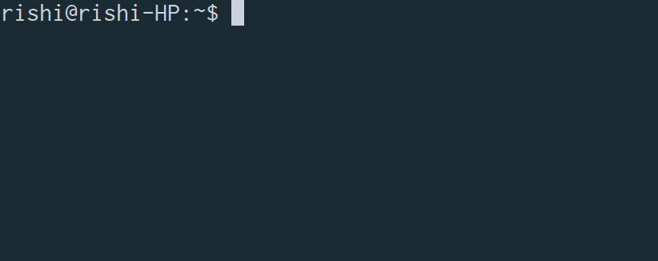

# 

> :telescope: A command line Instagram media notifier!

<p align="center">
	
	<br>
	<br>
	
	<a href="https://travis-ci.org/CodeDotJS/instafy">
	
	</a>
</p>

## Why?

- Prevents from polluting your browser history.

- Check profile only if user has uploaded any new image.


## Install

```
$ npm install --global instafy
```
__`OR`__
```
$ sudo npm install --global instafy
```

## Usage

```
 Usage   : instafy [username]

 Example : instafy iama_rishi

 Help    : instafy -h or --help

 Version : instafy -v or --version
```


__`NOTE :`__ 

- You've to run the script twice.

When you run `instafy`, it first saves the username and their current post.
So, when you run it again, it compares the posts count and notify you
accordingly.

So, first initialize the users whose post you don't want to miss.
Run `instafy` to check wheather they have uploaded any new image.

Anytime.


- Not tested on Windows and MacOS

You can submit a PR or Issue for windows and mac support.

## Related

- [instavim](https://github.com/CodeDotJS/instavim) : Command line Instagram media downloader.

## License

MIT © [Rishi Giri](https://rishigiri.com)
